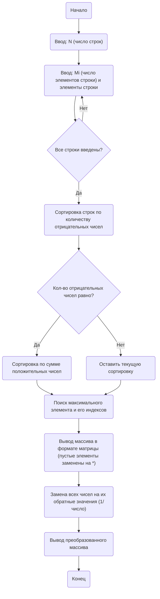

## Отчет по лабораторной работе № 1

#### № группы: `ПМ-2403`

#### Выполнил: `Зайцев Кирилл Владимирович`

#### Вариант: `8`

### Cодержание:

- [Постановка задачи](#1-постановка-задачи)
- [Входные и выходные данные](#2-входные-и-выходные-данные)
- [Выбор структуры данных](#3-выбор-структуры-данных)
- [Алгоритм](#4-алгоритм)
- [Программа](#5-программа)
- [Анализ правильности решения](#6-анализ-правильности-решения)

### 1. Постановка задачи
> Программа работает с двумерным массивом вещественных чисел разной длины. Она должна:
>1. Считать с консоли число строк 𝑁. Затем для каждой
строки вывести количество элементов 𝑀𝑖
, после чего ввести
элементы строки, формируя массив размером 𝑁 строк разной
длины.
>2. Отсортировать строки массива по возрастанию количества
отрицательных чисел в строке. Если количества равны,
отсортировать строки по возрастанию суммы положительных
чисел.
>3. Найти и вывести максимальное число в массиве и
его индексы (номер строки и позиция в строке).
>4. Вывести элементы массива в виде матрицы, заполняя
недостающие элементы в строках символом «*».
>5. Заменить все числа в массиве на их обратные значения
(1/число) и вывести полученный массив.

### 2. Входные и выходные данные
#### Данные на вход
|             | Тип         | min значение    | max значение   |
|-------------|-------------|-----------------|----------------|
| N (Количество строк массива) | Целое число | 0  | 2*10<sup>9</sup> |
| Mi (	Количество элементов в i-й строке) | Целое число | 0 |  2*10<sup>9</sup> |
| (Элементы строки) | Вещественные числа | -1.7*10<sup>308</sup> | 1.7*10<sup>308</sup> |

#### Данные на выход
Отсортированный массив в виде матрицы.
Максимальное число массива и его индексы.
Преобразованный массив с обратными значениями элементов.

### 3. Выбор структуры данных
Для решения задачи используются:
- Двумерный список (ArrayList<ArrayList<Double>>): для хранения элементов массива, где каждая строка может иметь разное количество элементов.
- Одномерный список: для подсчета отрицательных чисел и суммы положительных чисел для каждой строки.
- Переменные для хранения индексов и значений максимального элемента.

### 4. Алгоритм
#### Алгоритм выполнения программы:
1. Считать число строк N
2. Для каждой строки:
- Ввести Mi — количество элементов в строке.
- Ввести 𝑀𝑖 вещественных чисел, добавить их в массив.
3. Отсортировать строки массива:
- Подсчитать количество отрицательных чисел в строке.
- Если количество отрицательных чисел одинаково, подсчитать сумму положительных чисел.
4. Найти максимальный элемент в массиве и его индексы.
5. Вывести массив в формате матрицы, заполняя пустые элементы символом *.
6. Преобразовать массив, заменяя каждый элемент x на его обратное значение (1/x).
7. Вывести преобразованный массив.

#### Блок-схема


### 5. Программа
```java
import java.util.Scanner;

public class MatrixProcessor {

    public static void main(String[] args) {
        Scanner scanner = new Scanner(System.in);

        // Ввод количества строк
        System.out.print("Введите количество строк (N): ");
        int n = scanner.nextInt();

        // Объявление матрицы и массивов для сортировки
        int[][] matrix = new int[n][];
        int[] negativeCount = new int[n];
        int[] positiveSum = new int[n];

        // Ввод данных
        for (int i = 0; i < n; i++) {
            System.out.print("Введите количество элементов в строке " + (i + 1) + ": ");
            int m = scanner.nextInt();
            matrix[i] = new int[m];

            System.out.println("Введите элементы строки " + (i + 1) + ":");
            for (int j = 0; j < m; j++) {
                matrix[i][j] = scanner.nextInt();
                // Подсчёт отрицательных чисел
                if (matrix[i][j] < 0) {
                    negativeCount[i]++;
                }
                // Подсчёт суммы положительных чисел
                if (matrix[i][j] > 0) {
                    positiveSum[i] += matrix[i][j];
                }
            }
        }

        // Сортировка строк по количеству отрицательных чисел, затем по сумме положительных чисел
        for (int i = 0; i < n - 1; i++) {
            for (int j = i + 1; j < n; j++) {
                if (negativeCount[i] > negativeCount[j] ||
                        (negativeCount[i] == negativeCount[j] && positiveSum[i] > positiveSum[j])) {
                    // Меняем строки местами
                    int[] tempRow = matrix[i];
                    matrix[i] = matrix[j];
                    matrix[j] = tempRow;

                    // Меняем данные для сортировки
                    int tempNeg = negativeCount[i];
                    negativeCount[i] = negativeCount[j];
                    negativeCount[j] = tempNeg;

                    int tempSum = positiveSum[i];
                    positiveSum[i] = positiveSum[j];
                    positiveSum[j] = tempSum;
                }
            }
        }

        // Поиск максимального элемента и его индексов
        int max = Integer.MIN_VALUE;
        int maxRow = -1, maxCol = -1;
        for (int i = 0; i < n; i++) {
            for (int j = 0; j < matrix[i].length; j++) {
                if (matrix[i][j] > max) {
                    max = matrix[i][j];
                    maxRow = i;
                    maxCol = j;
                }
            }
        }

        // Вывод матрицы в формате таблицы
        System.out.println("Отсортированная матрица:");
        int maxLength = getMaxRowLength(matrix);
        for (int i = 0; i < n; i++) {
            for (int j = 0; j < maxLength; j++) {
                if (j < matrix[i].length) {
                    System.out.print(matrix[i][j] + "\t");
                } else {
                    System.out.print("*\t");
                }
            }
            System.out.println();
        }

        System.out.println("Максимальный элемент: " + max + " (строка " + (maxRow + 1) + ", столбец " + (maxCol + 1) + ")");

        // Преобразование элементов на обратные значения
        for (int i = 0; i < n; i++) {
            for (int j = 0; j < matrix[i].length; j++) {
                if (matrix[i][j] != 0) {
                    matrix[i][j] = 1 / matrix[i][j];
                }
            }
        }

        // Вывод преобразованной матрицы
        System.out.println("Преобразованная матрица:");
        for (int i = 0; i < n; i++) {
            for (int j = 0; j < maxLength; j++) {
                if (j < matrix[i].length) {
                    System.out.print(matrix[i][j] + "\t");
                } else {
                    System.out.print("*\t");
                }
            }
            System.out.println();
        }

        scanner.close();
    }

    // Вспомогательная функция для определения максимальной длины строки
    private static int getMaxRowLength(int[][] matrix) {
        int maxLength = 0;
        for (int[] row : matrix) {
            if (row.length > maxLength) {
                maxLength = row.length;
            }
        }
        return maxLength;
    }
}


```

### 6. Анализ правильности решения
Программа успешно выполняет поставленные задачи.
1. Тест:
    - **Input**:
        ```
        3
        3
        1.0 -2.0 3.0
        2
        -5.0 2.0
        4
        1.0 -1.0 2.0 -3.0
        ```

    - **Output**:
        ```
        Отсортированный массив в виде матрицы:
        1.00 -2.00 3.00 *
        1.00 -1.00 2.00 -3.00
        -5.00 2.00 * *

        Максимальный элемент: 3.0 (строка 1, позиция 3)

        Массив после замены на обратные значения:
        1.00 -0.50 0.33 *
        1.00 -1.00 0.50 -0.33
        -0.20 0.50 * *
        ```
